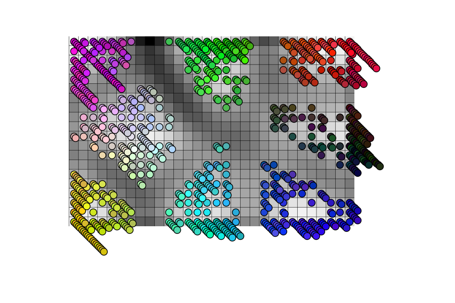
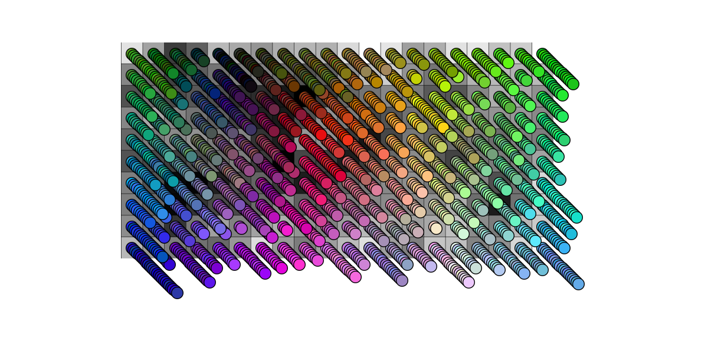

# Kohonen Self-Organizing Map in Python & NumPy

Kohonen self-organizing map is one of the rare unsupervised neural network algorithms. It can be used to clusterize data feature vectors, to create data visualizations, and for numerous other purposes. 

The Kohonen SOM is not in the current machine learning mainstream, so up-to-date implementations are rarely available. I created this example using fully Python and I used as much NumPy processing as possible to speed-up the map training process. Turns out that this implementation runs bit faster on a CPU-only machine than the Tensorflow implementation that I used in the Color Palette code (https://github.com/Kursula/Color_palette)

Kohonen SOM papers and information is widely available in the net and one good starting point is the wikipedia page: 
https://en.wikipedia.org/wiki/Self-organizing_map

One example of a SOM data clustering is shown below, where input data was vectors of length 3 divided to eight different clusters. The data poins were colored according to the vector locations. In this example the SOM clustering was perfectly accurate.

This SOM code uses random initialization for the map, so each map training will result in different looking map, as the cluster formation will start from random locations. If the map hyperparameters are selected correctly (map is not too big or too small, there are enough training iterations, etc.) the clusters will usually form correctly if the data can be split to clusters. 

If the data does not contain clusters, the algorithm will not force it to clusters. In that case the map self-organizes so that the data vectors are always located where the distance to nearby data vectors is as small as possible. Euclidean distance is traditionally used in Kohonen SOM. In this code there is also cosine distance implementation as an alternative, which might work better for e.g. CNN feature vectors. 

The picture below illustrates the map result when there are no clusters in the data. In that example the input data was 2000 points of linearly distributed random RGB values between [0, 0, 0] and [1, 1, 1]. The map size is 20 x 10 nodes. 

## Code structure

Most of the basic building blocks are located in the som.py, which contains the SOM class and method for plotting the map with data overlay. 

The Jupyter notebook RGB_SOM shows a simple example where 3-dimensional vectors are mapped to 2D map using the SOM. 

SOM application for unsupervised CNN-based image feature vector clustering is coming soon... 

